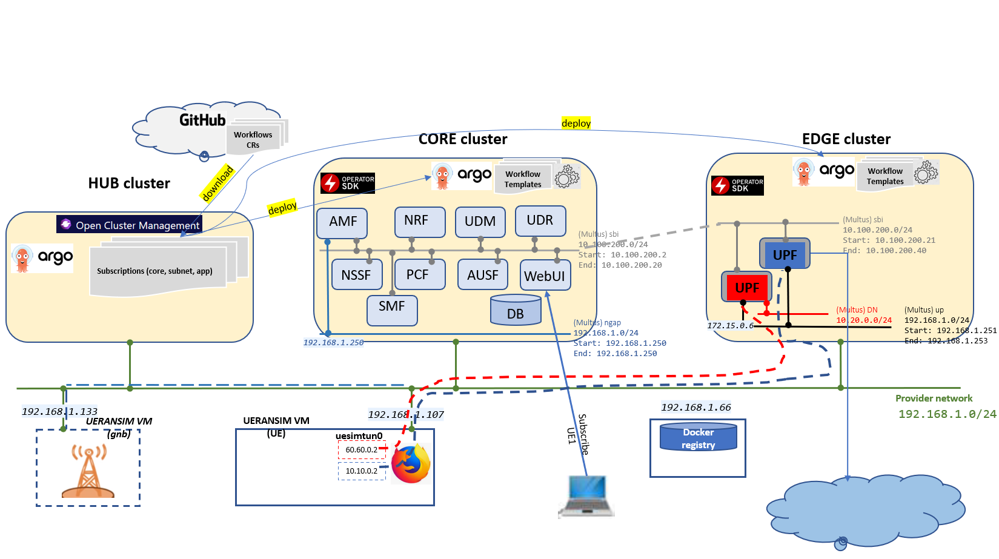

# issm-mec-cnmp

## Introduction

The goal of the platform is to deploy 5G slices natively on K8s in a multi-cluster environment to allow K8s native applications to consume 5G networking directly in the K8s clusters serving as NFVI. The design is VIM-less. Both slice and applications are treated as K8s native services. Kubernitized free5GC is used as a running example to illustrate the concepts. Distributed NFVI is managed via [Open Cluster Management](https://open-cluster-management.io/) open source project. The management workflows are implemented as [Argo](https://github.com/argoproj/argo-workflows) templatized workflows. Informally, the workflows are of two kinds: local and global. The former ones execute autonomously in a specific NFVI (K8s cluster) and the global ones span different NFVIs and the management hub cluster. When synchronization of any kind is required among the local workflows (perhaps being part of a global one), synchronization and parameter passing is done via message passing using [Kafka message bus](https://kafka.apache.org/) in the management hub cluster. Architecturally, the management hub cluster is located in Core and represents MEC System, while other K8s clusters (NFVI) are located in Edge (RAN) and Transport.



## System Requirements

Use [these instructions](docs/kubernetes.md) to deploy three kubernetes clusters each with master/worker installed with a VM of Ubuntu 20.04 allocated with 2vCPUs, 8GB RAM and 100 GB disk

* OCM Hub: 1 master, 1 worker
* Core: 1 master, 2 workers
* Edge: 1 master, 1 worker

Create two fresh Ubuntu 20.04 VMs allocated with 4 vCPU, 8 GB RAM and 50 GB

* gNB node
* UE (user-equipment)

**Important**: ensure VMs network interfaces set with the same name e.g. `ens3`

## Open Cluster Manager

After creating the three kubernetes clusters, install OCM and register it with the two clusters 'Core' and 'Edge'

Follow [these](./docs/ocm.md) instructions to install OCM

**Note:** register the Core and Edge clusters `cluster-1` and `cluster-2` respectively

## K8s networking

Perform the below instructions to install multus and IPAM whereabouts

Do this for both core and edge clusters

### Multus

Log into k8s master

Perform the below steps per this [Installation](https://github.com/k8snetworkplumbingwg/multus-cni/blob/v3.8/docs/quickstart.md#installation) guide

```
cd ~
git clone https://github.com/k8snetworkplumbingwg/multus-cni.git && cd multus-cni
git checkout tags/v3.8
```

```
cat ./images/multus-daemonset.yml | kubectl apply -f -
```

Wait for multus pods to become active

### Whereabouts

Log into k8s master

Perform the below steps per this [Installation](https://github.com/k8snetworkplumbingwg/whereabouts/tree/ee60ed15c45d6fcdbccc995caeadb20928cfdadc#installing-whereabouts) guide

```
cd ~
git clone https://github.com/k8snetworkplumbingwg/whereabouts && cd whereabouts
git checkout ee60ed15c45d6fcdbccc995caeadb20928cfdadc
```

```
kubectl apply \
    -f doc/crds/daemonset-install.yaml \
    -f doc/crds/whereabouts.cni.cncf.io_ippools.yaml \
    -f doc/crds/whereabouts.cni.cncf.io_overlappingrangeipreservations.yaml \
    -f doc/crds/ip-reconciler-job.yaml
```

Wait for whereabouts pods to become active

## Argo

Perform the below instructions to install Argo controller

Do this for all three clusters: hub, core and edge clusters

### Install Argo workflow manager

[Set up argo](./docs/argo.md)

### Apply argo roles

Have Argo to run free5gc workflows under `domain-operator-a` , `domain-operator-b`, `domain-operator-c`, namespaces.

```
# operator-a
export NAMESPACE=domain-operator-a
kubectl create namespace $NAMESPACE
envsubst < workflows/argo/role.yaml.template | kubectl apply -n $NAMESPACE -f -

# operator-b
export NAMESPACE=domain-operator-b
kubectl create namespace $NAMESPACE
envsubst < workflows/argo/role.yaml.template | kubectl apply -n $NAMESPACE -f -

# operator-c
export NAMESPACE=domain-operator-c
kubectl create namespace $NAMESPACE
envsubst < workflows/argo/role.yaml.template | kubectl apply -n $NAMESPACE -f -
```


### Apply common argo templates

```
# operator-a
export NAMESPACE=domain-operator-a
kubectl apply -f  workflows/common-templates  -n $NAMESPACE

# operator-b
export NAMESPACE=domain-operator-b
kubectl apply -f  workflows/common-templates  -n $NAMESPACE

# operator-c
export NAMESPACE=domain-operator-c
kubectl apply -f  workflows/common-templates  -n $NAMESPACE
```

## Kafka

Components synch among each other using kafka bus

Install and configure kafka [here](./docs/kafka.md)

## 5G Operator

5G Operator acts as a VNFM for free5gc network functions

Perform the [following](./docs/5g-operator.md) instructions to install the 5G Operator

Do this for both core and edge clusters


## gtp5g kernel module

Perform the below instructions to install the gtp5g kernel module that will be used by the dataplane function

Do this for all worker nodes on both core and edge clusters

### Install pre-requisites

```
sudo apt-get install libtool
sudo apt-get install pkg-config
sudo apt-get install libmnl-dev
sudo apt install make
sudo apt install net-tools
```

### Build and install

```
cd ~
git clone https://github.com/free5gc/gtp5g.git && cd gtp5g
git checkout tags/v0.4.1
make clean && make
sudo make install
```

### Set promsic on

Invoke the below against the main network interface

```
sudo ip link set ens3 promisc on
```

## 5G Init-container

5G Init-container get invoked during `Init` phase of free5gc NF deployment. It is responsible to setup DNS service name mappings for the various networks

Refer [here](./5ginitcontainer) for more details

## free5gc images

Log into host installed with docker and has access to docker.pkg.github.com

**Note:** ensure to build images out from free5gc `v3.0.6` and the dynamic-load version of smf

### Build

```
# Clone free5gc-compose project
cd ~
git clone https://github.com/5GZORRO/free5gc-compose.git
cd free5gc-compose
git checkout free5gc-compose-e0d4742-nf_build

# clone free5gc v3.0.6
cd base
git clone --recursive -b v3.0.6 -j `nproc` https://github.com/free5gc/free5gc.git

# replace smf with dynamic-load version
cd free5gc/NFs
rm -Rf smf
git clone https://github.com/5GZORRO/free5gc-smf.git
cd smf
git checkout smf-46644f0-dynamic-load

# Build the images
cd ~/free5gc-compose
make all
docker-compose build
```

### Tag and Push to registry

**Do this only in case images are not deployed [here](https://github.com/orgs/5GZORRO/packages?tab=packages&visibility=all&sort_by=downloads_asc&q=issm-mec-cnmp)**

Ensure to properly tag the images built from the previous step - into the below names

```
docker.pkg.github.com/5gzorro/issm-mec-cnmp/free5gc-udr:v3.0.6
docker.pkg.github.com/5gzorro/issm-mec-cnmp/free5gc-udm:v3.0.6
docker.pkg.github.com/5gzorro/issm-mec-cnmp/free5gc-smf:v3.0.6-dynamic-load-2a0e447
docker.pkg.github.com/5gzorro/issm-mec-cnmp/free5gc-smf-ext:v3.0.6-dynamic-load-c6fee5a
docker.pkg.github.com/5gzorro/issm-mec-cnmp/free5gc-pcf:v3.0.6
docker.pkg.github.com/5gzorro/issm-mec-cnmp/free5gc-nssf:v3.0.6
docker.pkg.github.com/5gzorro/issm-mec-cnmp/free5gc-ausf:v3.0.6
docker.pkg.github.com/5gzorro/issm-mec-cnmp/free5gc-amf:v3.0.6
docker.pkg.github.com/5gzorro/issm-mec-cnmp/free5gc-nrf:v3.0.6
docker.pkg.github.com/5gzorro/issm-mec-cnmp/free5gc-upf:v3.0.6
docker.pkg.github.com/5gzorro/issm-mec-cnmp/free5gc-webui:v3.0.6
```

then push them with `docker push ...`

### Install additional tools into UPF

```
docker build --tag docker.pkg.github.com/5gzorro/issm-mec-cnmp/free5gc-upf-tools:v3.0.6 --force-rm=true -f ./Dockerfile.upf .
```

then push it with `docker push ...`


### Private registry

This MEC setup uses private image registry to store free5gc and other helper images. This is to avoid the reconfiguration of
service accounts and rbac roles as well as hitting docker pull requests limit

Refer [here](./docs/registry.md) for setting the private registry


## UERANSIM

https://github.com/aligungr/UERANSIM.git

Perform the below instructions to install ue ran simulator

Do this for both gNB and UE VMs

### Clone UERANSIM

```
cd ~
git clone https://github.com/aligungr/UERANSIM.git
cd UERANSIM
git checkout tags/v3.2.5 -b v3.2.5-branch
```

### Install UERANSIM

The below instructions are derived from [ueransim-installation](https://github.com/aligungr/UERANSIM/wiki/Installation)

```
sudo apt install make
sudo apt install gcc
sudo apt install g++
sudo apt install libsctp-dev lksctp-tools
sudo apt install iproute2
sudo snap install cmake --classic
```

Build

```
cd ~/UERANSIM
make
```

## Deployment

### Pre-requisite

Perform the below before the deployment

Log into OCM hub cluster

Configure the git-subscription channel to point to fiveg packages github

```
kubectl apply -f workflows/argo-acm/remote-git-sub/01-namespace.yaml
kubectl apply -f workflows/argo-acm/remote-git-sub/02-channel.yaml
```

### **Deploy core**

Kick off free5gc core deployment

Log into OCM hub cluster

```
cd ~/issm-mec-cnmp
argo -n domain-operator-a submit workflows/argo-acm/fiveg-core.yaml --parameter-file workflows/argo-acm/core.json --watch
```

wait for the flow to complete

### Start gNB

Log into gNB VM (192.168.1.133)

Customize free5gc-gnb.yaml to support the two slices (010203, 112233)

```diff
index 81bb13b..e28f0be 100644
--- a/config/free5gc-gnb.yaml
+++ b/config/free5gc-gnb.yaml
@@ -5,13 +5,13 @@ nci: '0x000000010'  # NR Cell Identity (36-bit)
 idLength: 32        # NR gNB ID length in bits [22...32]
 tac: 1              # Tracking Area Code

-linkIp: 127.0.0.1   # gNB's local IP address for Radio Link Simulation (Usually same with local IP)
-ngapIp: 127.0.0.1   # gNB's local IP address for N2 Interface (Usually same with local IP)
-gtpIp: 127.0.0.1    # gNB's local IP address for N3 Interface (Usually same with local IP)
+linkIp: 192.168.1.133   # gNB's local IP address for Radio Link Simulation (Usually same with local IP)
+ngapIp: 192.168.1.133   # gNB's local IP address for N2 Interface (Usually same with local IP)
+gtpIp: 192.168.1.133    # gNB's local IP address for N3 Interface (Usually same with local IP)

 # List of AMF address information
 amfConfigs:
-  - address: 127.0.0.1
+  - address: 192.168.1.250
     port: 38412

 # List of supported S-NSSAIs by this gNB
 slices:
   - sst: 0x1
     sd: 0x010203
+  - sst: 0x1
+    sd: 0x112233

 # Indicates whether or not SCTP stream number errors should be ignored.
 ignoreStreamIds: true
```

start gnb

```
cd ~/UERANSIM/build
./nr-gnb  -c ../config/free5gc-gnb.yaml
```

### Subscribe UE

Login to free5gc portal and subscribe your ue

Browse to `http://<core cluster master ipaddress>:30050`
login with `admin/free5gc`

New subscriber -> accept all defaults -> Submit  

### Add UE into topology group

Add the ue into proper topology group slice.

Run the below to add `imsi-208930000000003` into `1-010203`

```
curl -X POST http://<core cluster master ipaddress>:<smf-ext-nodeport>/ue-routes/1-010203/members/imsi-208930000000003
```

### **Deploy subnet slice** (010203)

Log into OCM hub cluster

```
argo -n domain-operator-b  submit workflows/argo-acm/fiveg-subnet.yaml --parameter-file workflows/argo-acm/subnet-010203.json --watch
```

wait for the flow to complete

**NOTE:** to delete a given subnetslice invoke the below setting `fiveg_subnet_id` to its proper value

```bash
argo -n domain-operator-b  submit workflows/argo-acm/fiveg-subnet-delete.yaml -p fiveg_subnet_id="fiveg-subnet-lx29w" --watch
```

### Connect UE to slice

Log into UE VM (192.168.1.107)

Customize free5gc-ue.yaml to use slice 010203

```diff
--- a/config/free5gc-ue.yaml
+++ b/config/free5gc-ue.yaml
@@ -20,7 +20,7 @@ imeiSv: '4370816125816151'

 # List of gNB IP addresses for Radio Link Simulation
 gnbSearchList:
-  - 127.0.0.1
+  - 192.168.1.133

 # Initial PDU sessions to be established
 sessions:
@@ -38,7 +38,7 @@ configured-nssai:
 # Default Configured NSSAI for this UE
 default-nssai:
   - sst: 1
-    sd: 1

 # Supported encryption algorithms by this UE
 integrity:
```

Establish PDU session on this slice

```bash
sudo -s
cd ~/UERANSIM/build
./nr-ue -c ../config/free5gc-ue.yaml
```

Open another terminal on UE VM and perform the below to transfer data over this slice

```
curl --interface uesimtun0 google.com
```

## Maintainers
**Avi Weit** - weit@il.ibm.com

**David Breitgand** - davidbr@il.ibm.com

## Licensing

This 5GZORRO component is published under Apache 2.0 license. Please see the [LICENSE](./LICENSE) file for further details.
