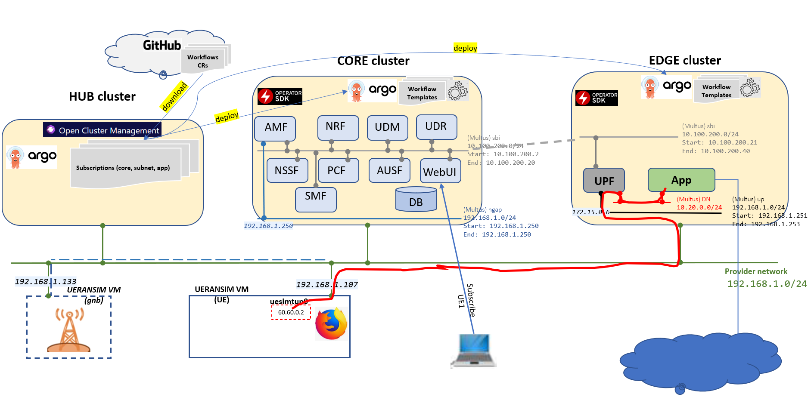

# issm-mec-cnmp

Use [these instructions](docs/kubernetes.md) to deploy three kubernetes clusters

* OCM Hub: 1 master, 1 worker
* Core: 1 master, 2 workers
* Edge: 1 master, 1 worker

Create two fresh **Ubuntu 20.04** VMs: 4 vCPU, 8 GB RAM, 50 GB for

* gNB node
* UE (user-equipment)

**Important**: ensure VMs network interfaces set with the same name e.g. `ens3`



## Open Cluster Manager

After creating the three kubernetes clusters, install OCM and register it with the two clusters 'Core' and 'Edge'

Follow [these](./docs/ocm.md) instructions to install OCM

**Note:** register the Core and Edge clusters `bcn-core` and `bcn-edge` respectively

## K8s networking

Perform the below instructions to install multus and IPAM whereabouts

Do this for both core and edge clusters

### Multus

Log into k8s master

Perform the below steps per this [Installation](https://github.com/k8snetworkplumbingwg/multus-cni/blob/v3.8/docs/quickstart.md#installation) guide

```
cd ~
git clone https://github.com/k8snetworkplumbingwg/multus-cni.git && cd multus-cni
git checkout tags/v3.8
```

```
cat ./images/multus-daemonset.yml | kubectl apply -f -
```

Wait for multus pods to become active

### Whereabouts

Log into k8s master

Perform the below steps per this [Installation](https://github.com/k8snetworkplumbingwg/whereabouts/tree/ee60ed15c45d6fcdbccc995caeadb20928cfdadc#installing-whereabouts) guide

```
cd ~
git clone https://github.com/k8snetworkplumbingwg/whereabouts && cd whereabouts
git checkout ee60ed15c45d6fcdbccc995caeadb20928cfdadc
```

```
kubectl apply \
    -f doc/crds/daemonset-install.yaml \
    -f doc/crds/whereabouts.cni.cncf.io_ippools.yaml \
    -f doc/crds/whereabouts.cni.cncf.io_overlappingrangeipreservations.yaml \
    -f doc/crds/ip-reconciler-job.yaml
```

Wait for whereabouts pods to become active

## Argo

Perform the below instructions to install Argo controller

Do this for all three clusters: hub, core and edge clusters

### Install Argo workflow manager

[Set up argo](./docs/argo.md)

### Apply argo roles

Have Argo to run free5gc workflows under `5g-core` namespace.

```
kubectl create namespace 5g-core
kubectl apply -f workflows/argo/role.yaml
```

### Apply common argo templates

```
kubectl apply -f  workflows/common-templates  -n 5g-core
```

## 5G Operator

5G Operator acts as a VMFM for free5gc network functions

Perform the [following](./docs/5g-operator.md) instructions to install the 5G Operator

Do this for both core and edge clusters


## gtp5g kernel module

Perform the below instructions to install the gtp5g kernel module that will be used by the dataplane function

Do this for all worker nodes on both core and edge clusters

### Install pre-requisites

```
sudo apt-get install libtool
sudo apt-get install pkg-config
sudo apt-get install libmnl-dev
sudo apt install make
sudo apt install net-tools
```

### Build and install

```
cd ~
git clone https://github.com/PrinzOwO/gtp5g && cd gtp5g
git checkout tags/v0.3.2
make clean && make
sudo make install
```

### Set promsic on

Invoke the below against the main network interface

```
sudo ip link set ens3 promisc on
```

## UERANSIM

https://github.com/aligungr/UERANSIM.git

Perform the below instructions to install ue ran simulator

Do this for both gNB and UE VMs

### Clone UERANSIM

```
cd ~
git clone https://github.com/aligungr/UERANSIM.git
cd UERANSIM
git checkout tags/v3.2.0 -b v3.2.0-branch
```

### Install UERANSIM

The below instructions are derived from [ueransim-installation](https://github.com/aligungr/UERANSIM/wiki/Installation)

```
sudo apt install make
sudo apt install gcc
sudo apt install g++
sudo apt install libsctp-dev lksctp-tools
sudo apt install iproute2
sudo snap install cmake --classic
```

Build

```
cd ~/UERANSIM
make
```

## Deployment

### **Deploy core**

Kick off free5gc core deployment

Log into ACM hub cluster

```
cd ~/issm-mec-cnmp
argo -n 5g-core  submit workflows/argo-acm/fiveg-core.yaml --parameter-file workflows/argo-acm/core.json --watch
```

wait for the flow to complete

### Start gNB

Log into gNB VM (192.168.1.133)

Customize free5gc-gnb.yaml to support the two slices (010203, 112233)

```diff
index 81bb13b..e28f0be 100644
--- a/config/free5gc-gnb.yaml
+++ b/config/free5gc-gnb.yaml
@@ -5,13 +5,13 @@ nci: '0x000000010'  # NR Cell Identity (36-bit)
 idLength: 32        # NR gNB ID length in bits [22...32]
 tac: 1              # Tracking Area Code

-linkIp: 127.0.0.1   # gNB's local IP address for Radio Link Simulation (Usually same with local IP)
-ngapIp: 127.0.0.1   # gNB's local IP address for N2 Interface (Usually same with local IP)
-gtpIp: 127.0.0.1    # gNB's local IP address for N3 Interface (Usually same with local IP)
+linkIp: 192.168.1.133   # gNB's local IP address for Radio Link Simulation (Usually same with local IP)
+ngapIp: 192.168.1.133   # gNB's local IP address for N2 Interface (Usually same with local IP)
+gtpIp: 192.168.1.133    # gNB's local IP address for N3 Interface (Usually same with local IP)

 # List of AMF address information
 amfConfigs:
-  - address: 127.0.0.1
+  - address: 192.168.1.250
     port: 38412

 # List of supported S-NSSAIs by this gNB
 slices:
   - sst: 0x1
     sd: 0x010203
+  - sst: 0x1
+    sd: 0x112233

 # Indicates whether or not SCTP stream number errors should be ignored.
 ignoreStreamIds: true
```

start gnb

```
cd ~/UERANSIM/build
./nr-gnb  -c ../config/free5gc-gnb.yaml
```

### Subscribe UE

Login to free5gc portal and subscribe your ue

Browse to `http://<core cluster master ipaddress>:30050`
login with `admin/free5gc`

New subscriber -> accept all defaults -> Submit  


### **Deploy subnet slice** (010203)

Log into ACM hub cluster

deploy subnet and wait for the flow to complete

```
argo -n 5g-core  submit workflows/argo-acm/fiveg-subnet.yaml --parameter-file workflows/argo-acm/subnet-010203.json --watch
```

wait for the flow to complete

### Connect UE to slice

Log into UE VM (192.168.1.107)

Customize free5gc-ue.yaml to use slice 010203

```diff
--- a/config/free5gc-ue.yaml
+++ b/config/free5gc-ue.yaml
@@ -20,7 +20,7 @@ imeiSv: '4370816125816151'

 # List of gNB IP addresses for Radio Link Simulation
 gnbSearchList:
-  - 127.0.0.1
+  - 172.15.0.211

 # Initial PDU sessions to be established
 sessions:
@@ -38,7 +38,7 @@ configured-nssai:
 # Default Configured NSSAI for this UE
 default-nssai:
   - sst: 1
-    sd: 1
+    sd: 010203

 # Supported encryption algorithms by this UE
 integrity:
```

Establish PDU session on this slice

```bash
sudo -s
cd ~/UERANSIM/build
./nr-ue -c ../config/free5gc-ue.yaml
```

Open another terminal on UE VM and perform the below to transfer data over this slice

```
curl --interface uesimtun0 google.com
```
